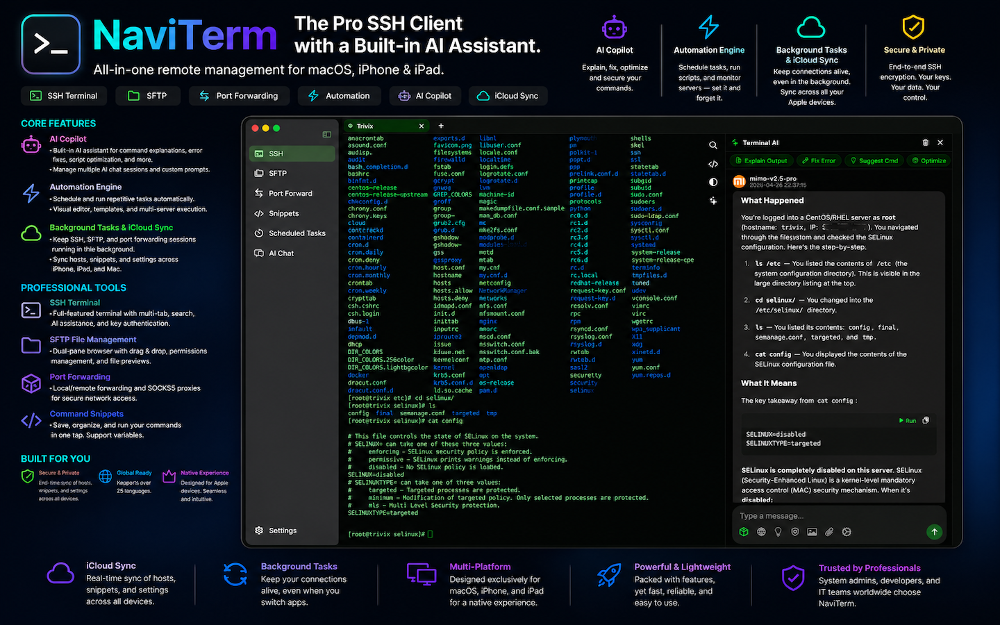
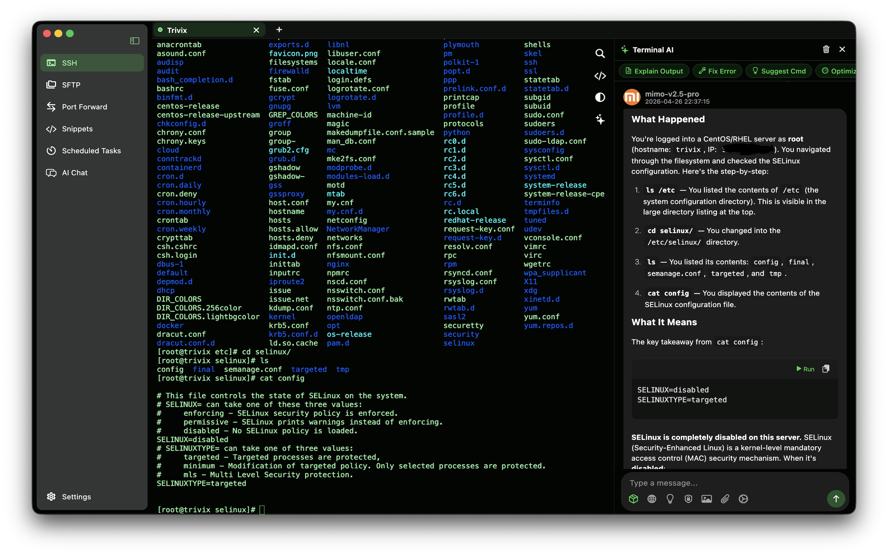
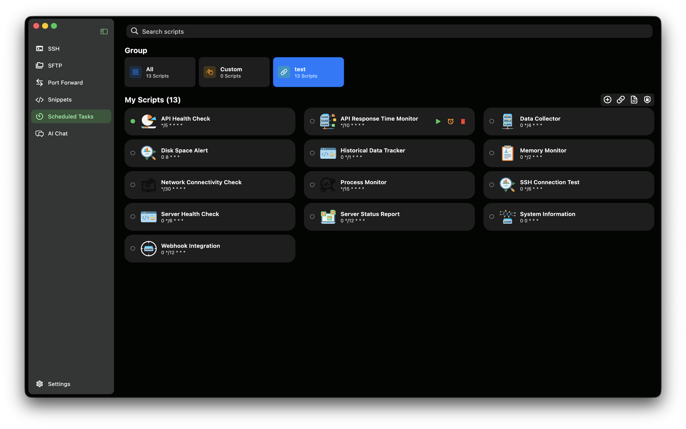
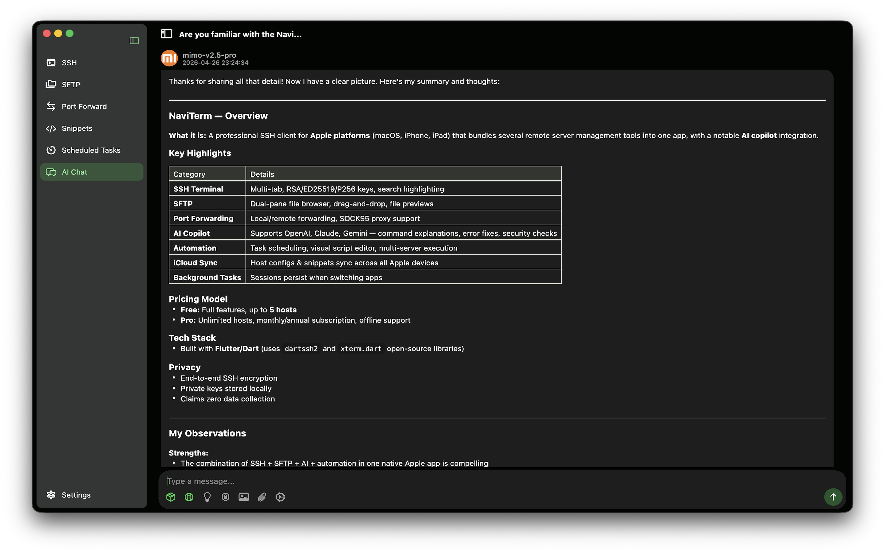
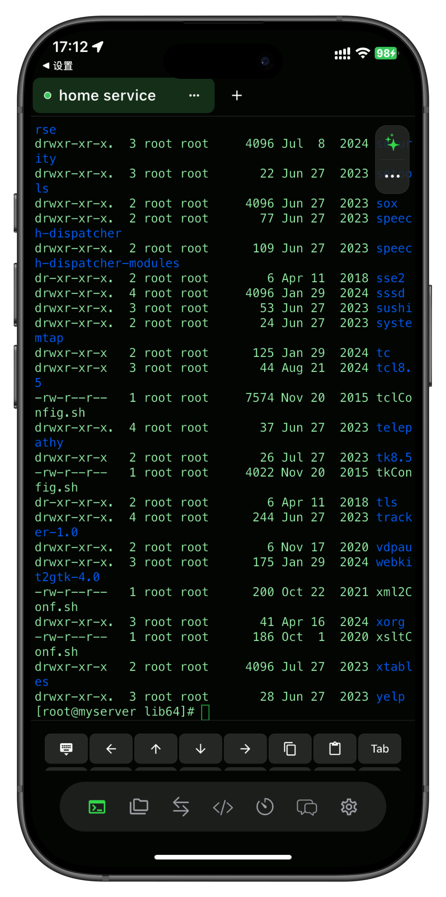
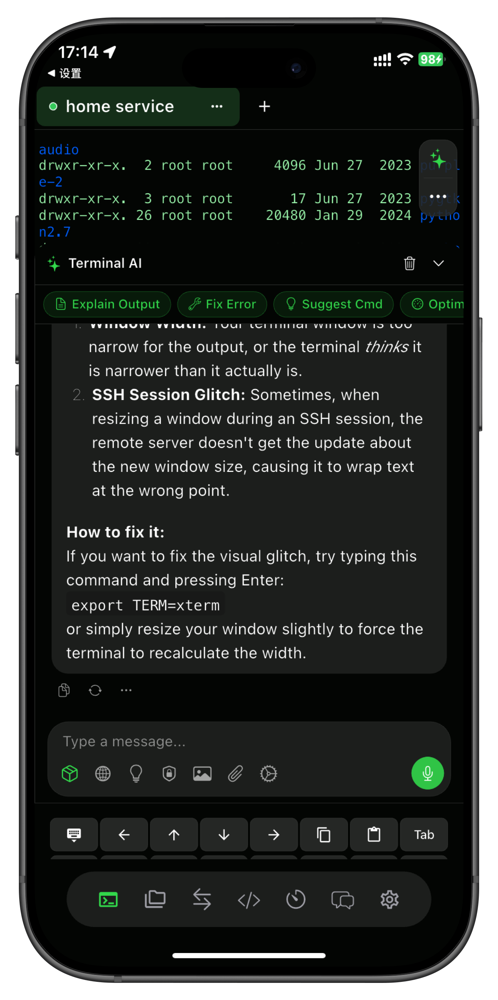
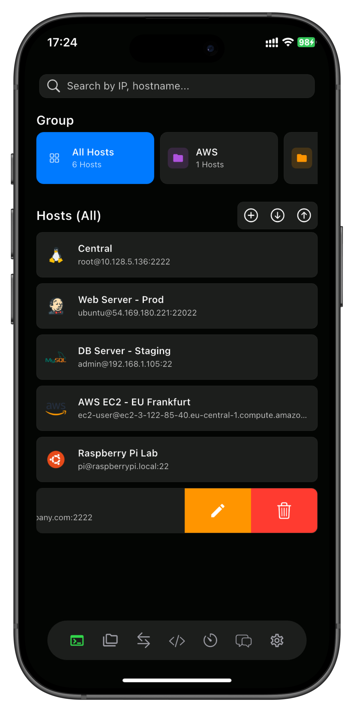
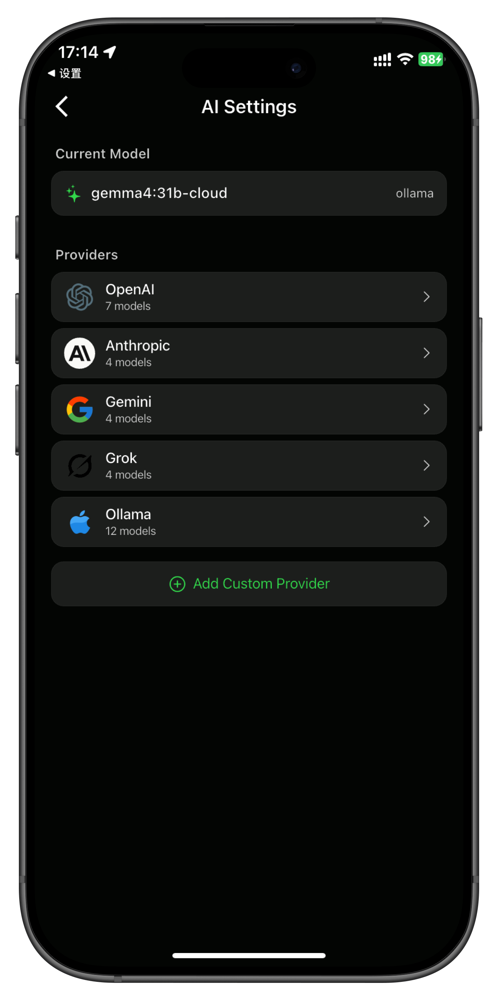
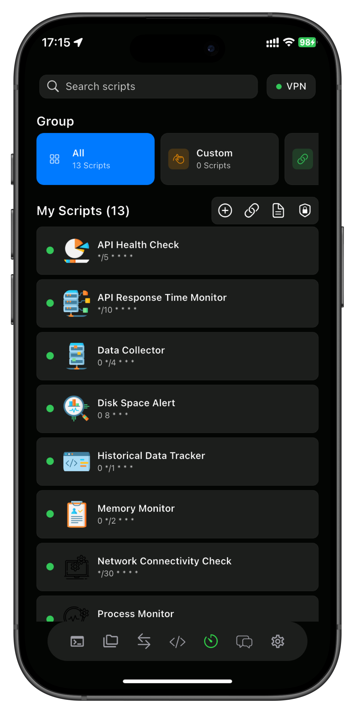
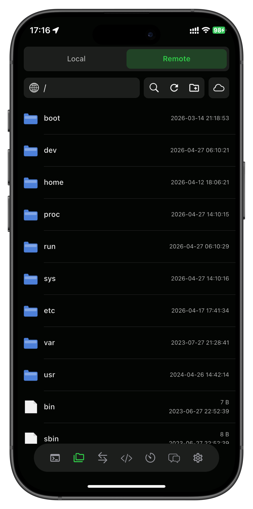

# NaviTerm

Idioma / Language: Español | [English](README.md) | [中文](README.zh.md) | [Français](README.fr.md) | [Deutsch](README.de.md) | [日本語](README.ja.md) | [Русский](README.ru.md)

Herramienta profesional de administración SSH con asistente de IA integrado. Combina terminal SSH, gestor de archivos SFTP, reenvío de puertos, automatización de tareas y un asistente inteligente de IA, diseñada específicamente para macOS, iPhone y iPad. Una única app para resolver todas vuestras necesidades de gestión remota, compatible con sincronización mediante iCloud y ejecución en segundo plano.

---

## Características principales

### Asistente inteligente de IA
- Panel de IA integrado en el terminal, compatible con OpenAI, Claude, Gemini y otros servicios
- Explicad las salidas de comandos, corregid errores, optimizad scripts y auditad la seguridad con un solo clic
- Gestión de conversaciones multisesión y plantillas personalizables para los prompts del sistema
- Sugerencias inteligentes de comandos para impulsar vuestra productividad

### Motor de automatización de tareas
- Programad tareas de mantenimiento repetitivas y olvidaos de hacerlas a mano
- Editor visual de scripts que no requiere conocimientos previos de programación
- Amplia galería de plantillas integradas: monitorización de servidores, análisis de logs y despliegues masivos
- Operaciones por lotes en múltiples servidores; completad tareas en varias máquinas con un solo clic

### Segundo plano en iOS + Sincronización de iCloud
- Las sesiones SSH, SFTP y de reenvío de puertos siguen funcionando en segundo plano; cambiad de app sin sufrir cortes
- Sincronización en tiempo real de la configuración de vuestros hosts y fragmentos de comandos entre el iPhone, el iPad y el ordenador Mac
- Los cambios en la nube se envían automáticamente, listos para usar en cualquier dispositivo al instante

---

## Funciones profesionales

### Terminal SSH
- Compatible con autenticación mediante claves RSA, ED25519 y P256
- Gestión mediante múltiples pestañas y emulación completa del terminal
- Búsqueda con resaltado dentro del terminal y asistencia inteligente de IA

### Gestor de archivos SFTP
- Navegador de doble panel: arrastrad y soltad para subir o descargar archivos
- Operaciones con archivos, modificación de permisos e indicador del progreso de transferencia
- Vista previa para múltiples tipos de archivo

### Reenvío de puertos
- Reenvío de puertos locales/remotos y proxy SOCKS5
- Transmisión cifrada mediante túnel SSH para acceder de forma segura a los servicios de vuestra red interna

### Fragmentos de comandos
- Guardad vuestros comandos más frecuentes para ejecutarlos rápidamente con un clic
- Compatibilidad con sustitución de variables para crear vuestra propia biblioteca de comandos personal

---

## Garantía técnica

- Seguro y fiable: cifrado SSH de extremo a extremo, las claves privadas solo se guardan en vuestro dispositivo local y con cero recopilación de datos
- Global: disponible en más de 25 idiomas
- Experiencia nativa: perfectamente adaptada al lenguaje de diseño de Apple

---

## Agradecimientos Especiales

Esta aplicación está construida con los siguientes proyectos de código abierto:

- [dartssh2](https://github.com/TerminalStudio/dartssh2) - Biblioteca cliente SSH para Dart
- [xterm.dart](https://github.com/TerminalStudio/xterm.dart) - Emulador de terminal para Flutter

---

## Modelo de Precios

- **Versión Gratuita**: Experiencia completa de funciones con hasta 5 hosts
- **Versión Pro**: Hosts ilimitados, disponible como suscripción mensual, suscripción anual o compra única de por vida
- **Los usuarios Pro disfrutan de soporte de uso sin conexión**

---

## Descargar

> Debido a requisitos de cumplimiento, NaviTerm se distribuye como dos aplicaciones separadas en la App Store. Por favor, elija la que coincida con la región de su App Store.

**Global (Todo el mundo excepto China continental)**

**China continental (中国大陆)**

---

## Únete a Nuestra Comunidad

- 📢 [Canal de Telegram](https://t.me/NavitermNews) - Obtén las últimas actualizaciones, lanzamientos de funciones y anuncios importantes
- 💬 [Grupo de Discusión de Telegram](https://t.me/NaviTermCommunity) - Conéctate con otros usuarios, comparte consejos e intercambia experiencias

---

## Guía de Canje de Códigos Promocionales

Ocasionalmente ofrecemos códigos promocionales de suscripción gratuita (1 mes o 1 año). Si has recibido un código promocional:

1. Abre la App Store en tu iPhone o Mac;
2. Toca tu icono de perfil > Canjear tarjeta de regalo o código;
3. Pega el código promocional y confirma;
4. Abre la aplicación NaviTerm y la suscripción se activará automáticamente.

📎 [Haz clic aquí para ver los códigos promocionales mensuales disponibles](promo-codes/monthly.txt)
📎 [Haz clic aquí para ver los códigos promocionales anuales disponibles](promo-codes/yearly.txt)

> Cantidad limitada, por orden de llegada. No se requiere registro ni información personal.

---

## Legal

- [Términos de Uso](https://www.apple.com/legal/internet-services/itunes/dev/stdeula/)
- [Política de Privacidad](https://www.trivix.cn/NaviTerm_Privacy_Policy.html)
- [Registro de Cambios](CHANGELOG.md)

---

<table style="width: 100%;">
<!-- 第一行 -->
<tr>
<td width="50%"></td>
<td width="50%"></td>
</tr>
<!-- 第二行 -->
<tr>
<td width="50%"></td>
<td width="50%"></td>
</tr>
<!-- 第三行 -->
<tr>
<td width="50%"></td>
<td width="50%"></td>
</tr>
</table>

<table style="width: 100%;">
<!-- 第一行 -->
<tr>
<td width="33.3%"></td>
<td width="33.3%"></td>
<td width="33.3%"></td>
</tr>
<!-- 第二行 -->
<tr>
<td width="33.3%"></td>
<td width="33.3%"></td>
<td width="33.3%"></td>
</tr>
<!-- 第三行 -->
<tr>
<td width="33.3%"></td>
<td width="33.3%"></td>
<td width="33.3%"></td>
</tr>
</table>