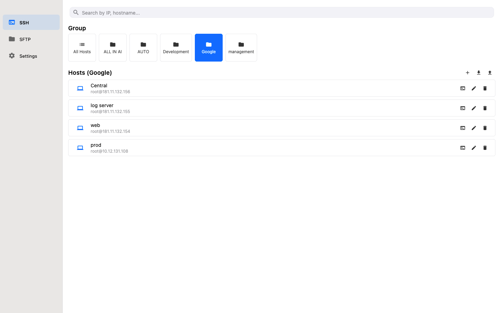
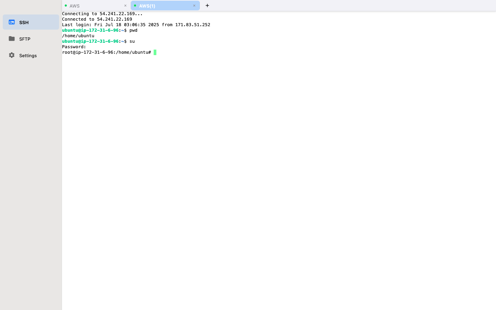

# NaviTerm

Idioma / Language: Español | [English](README.md) | [中文](README.zh.md) | [Français](README.fr.md) | [Deutsch](README.de.md) | [日本語](README.ja.md) | [Русский](README.ru.md)

Automatiza las operaciones de tu servidor con esta herramienta SSH profesional. Integra terminal SSH, gestión de archivos SFTP, reenvío de puertos, tareas automatizadas y fragmentos de comandos, diseñada desde cero para macOS, iPhone e iPad. Una aplicación para resolver todas tus necesidades de gestión remota, con sincronización iCloud y actividad en segundo plano.

---

## ✨ Nuevas Características

### Motor de Tareas Automatizadas
- Programa operaciones repetitivas para ejecutarse automáticamente
- Editor de scripts visual sin necesidad de experiencia en programación
- Plantillas integradas ricas: monitoreo de servidores, análisis de registros, implementación por lotes
- Operaciones por lotes en múltiples servidores con un solo toque
- Registros completos de tareas con resultados de ejecución claros

### Actividad en Segundo Plano
- Las sesiones SSH/SFTP/Reenvío de Puertos continúan ejecutándose en segundo plano
- Las conexiones permanecen activas incluso cuando cambias de aplicación o bloqueas la pantalla

### Sincronización iCloud entre Dispositivos
- Hosts, reenvíos de puertos y fragmentos de comandos se sincronizan en tiempo real entre iPhone, iPad y Mac
- Agrega una configuración en cualquier dispositivo y estará disponible instantáneamente en todos los demás
- Notificaciones push silenciosas mantienen los cambios de la nube sincronizados automáticamente

---

## 🔧 Funciones Principales

### Terminal SSH
- Autenticación por contraseña y clave privada (RSA, ED25519, P256)
- Gestiona múltiples servidores simultáneamente con interfaz de pestañas
- Emulación de terminal completa con soporte de colores y caracteres especiales
- Búsqueda en terminal con resaltado

### Fragmentos de Comandos
- Guarda comandos de uso frecuente para ejecución con un toque
- Construye tu biblioteca personal de comandos y olvídate de la escritura repetitiva
- Sustitución de variables para adaptación flexible a diferentes escenarios

### Gestión de Archivos SFTP
- Navegador de archivos de doble panel con carga/descarga por arrastrar y soltar
- Renombrar, eliminar archivos y modificar permisos
- Progreso de transferencia en tiempo real con soporte de cancelación
- Vista previa de múltiples tipos de archivos

### Reenvío de Puertos
- Reenvío de puertos local/remoto
- Proxy dinámico SOCKS5
- Cifrado de túnel SSH
- Acceso seguro a servicios de red interna

### Gestión de Claves
- Compatible con OpenSSH: soporta Ed25519, RSA, P256/EC
- Almacenamiento local seguro, nunca se sube
- Autenticación rápida con un toque

---

## 🎯 Aspectos Técnicos Destacados

- **Seguro y Confiable**: Cifrado SSH de extremo a extremo, claves privadas almacenadas solo localmente, cero recopilación de datos
- **Global**: Soporta más de 25 idiomas
- **Experiencia Nativa**: Perfectamente adaptado al lenguaje de diseño de Apple, diseño responsivo, controles por gestos

---

## 🙏 Agradecimientos Especiales

Esta aplicación está construida con los siguientes proyectos de código abierto:

- [dartssh2](https://github.com/TerminalStudio/dartssh2) - Biblioteca cliente SSH para Dart
- [xterm.dart](https://github.com/TerminalStudio/xterm.dart) - Emulador de terminal para Flutter

---

## 💎 Modelo de Suscripción

- **Versión Gratuita**: Experiencia completa de funciones con hasta 5 hosts
- **Versión Pro**: Hosts ilimitados con planes mensuales o anuales flexibles
- **Los suscriptores Pro disfrutan de soporte de uso sin conexión**

---

## 🚀 Descargar

---

## 💬 Únete a Nuestra Comunidad

- 📢 [Canal de Telegram](https://t.me/khgk180_na) - Obtén las últimas actualizaciones, lanzamientos de funciones y anuncios importantes
- 💬 [Grupo de Discusión de Telegram](https://t.me/kkkhjo_ut357) - Conéctate con otros usuarios, comparte consejos e intercambia experiencias

---

## 🎁 Guía de Canje de Códigos Promocionales

Ocasionalmente ofrecemos códigos promocionales de suscripción gratuita (1 mes o 1 año). Si has recibido un código promocional:

1. Abre la App Store en tu iPhone o Mac;
2. Toca tu icono de perfil > Canjear tarjeta de regalo o código;
3. Pega el código promocional y confirma;
4. Abre la aplicación NaviTerm y la suscripción se activará automáticamente.

📎 [Haz clic aquí para ver los códigos promocionales mensuales disponibles](promo-codes/monthly.txt)
📎 [Haz clic aquí para ver los códigos promocionales anuales disponibles](promo-codes/yearly.txt)

> Cantidad limitada, por orden de llegada. No se requiere registro ni información personal.

---

## 📜 Legal

- [Términos de Uso](https://www.apple.com/legal/internet-services/itunes/dev/stdeula/)
- [Política de Privacidad](https://www.trivix.cn/NaviTerm_Privacy_Policy.html)
- [Registro de Cambios](CHANGELOG.md)

---

