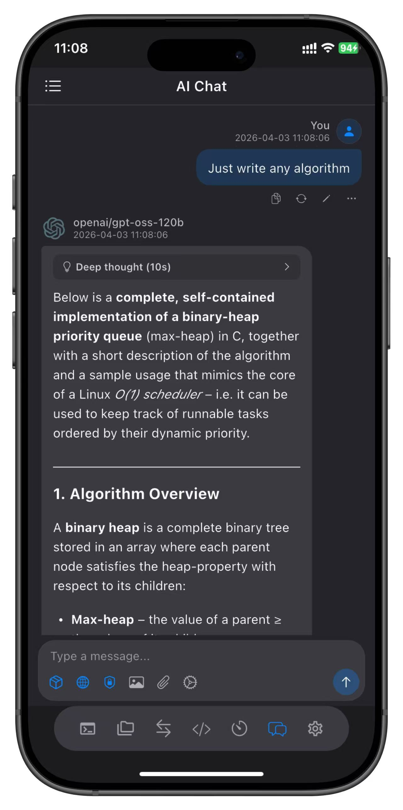

# NaviTerm

言語 / Language: 日本語 | [English](README.md) | [中文](README.zh.md) | [Español](README.es.md) | [Français](README.fr.md) | [Deutsch](README.de.md) | [Русский](README.ru.md)

プロフェッショナルなSSHツールでサーバー運用を自動化。SSHターミナル、SFTPファイル管理、ポートフォワーディング、自動化タスク、コマンドスニペットを統合し、macOS、iPhone、iPad向けに開発されました。リモート管理のすべてのニーズを1つのアプリで解決、iCloud同期とバックグラウンド実行をサポート。

---

## ✨ 新機能

### 自動化タスクエンジン
- 繰り返し作業を自動実行するようスケジュール設定
- ビジュアルスクリプトエディター：プログラミング経験不要
- 豊富な組み込みテンプレート：サーバー監視、ログ分析、一括デプロイ
- マルチサーバー一括操作：ワンタップで複数マシンのタスクを完了
- 完全なタスクログで実行結果を明確に記録

### バックグラウンド実行
- SSH/SFTP/ポートフォワーディングセッションがバックグラウンドで継続実行
- アプリを切り替えたり画面をロックしても接続を維持

### デバイス間iCloud同期
- ホスト、ポートフォワード、コマンドスニペットがiPhone、iPad、Mac間でリアルタイム同期
- 任意のデバイスで設定を追加すると、他のすべてのデバイスで即座に利用可能
- サイレントプッシュ通知でクラウドの変更が自動的に同期

---

## 🔧 コア機能

### SSHターミナル
- パスワードと秘密鍵認証（RSA、ED25519、P256）
- タブインターフェースで複数のサーバーを同時管理
- 色と特殊文字をサポートする完全なターミナルエミュレーション
- ハイライト付きターミナル内検索

### コマンドスニペット
- よく使うコマンドを保存してワンタップで実行
- 個人用コマンドライブラリを構築し、繰り返し入力から解放
- 変数置換で異なるシナリオに柔軟に対応

### SFTPファイル管理
- ドラッグ&ドロップでアップロード/ダウンロードできるデュアルパネルファイルブラウザ
- ファイルの名前変更、削除、権限変更
- リアルタイム転送進捗とキャンセルサポート
- 複数のファイルタイプのプレビュー

### ポートフォワーディング
- ローカル/リモートポートフォワーディング
- SOCKS5ダイナミックプロキシ
- SSHトンネル暗号化
- 内部ネットワークサービスへの安全なアクセス

### 鍵管理
- OpenSSH互換：Ed25519、RSA、P256/ECをサポート
- 安全なローカルストレージ、アップロードなし
- ワンタップで素早く認証

---

## 🎯 技術的ハイライト

- **安全で信頼性が高い**：エンドツーエンドSSH暗号化、秘密鍵はローカルのみに保存、データ収集なし
- **グローバル**：25以上の言語をサポート
- **ネイティブ体験**：Appleデザイン言語に完璧に適応、レスポンシブレイアウト、ジェスチャーコントロール

---

## 🙏 特別な感謝

このアプリは以下の素晴らしいオープンソースプロジェクトで構築されています：

- [dartssh2](https://github.com/TerminalStudio/dartssh2) - Dart用SSHクライアントライブラリ
- [xterm.dart](https://github.com/TerminalStudio/xterm.dart) - Flutter用ターミナルエミュレーター

---

## 💎 サブスクリプションモデル

- **無料版**：最大5ホストで完全な機能体験
- **Pro版**：柔軟な月額または年額プランで無制限のホスト
- **Proサブスクライバーはオフライン使用サポートを享受**

---

## 🚀 ダウンロード

---

## 🎁 プロモコード引き換えガイド

無料サブスクリプションプロモコード（1ヶ月または1年）を時々提供しています。プロモコードを受け取った場合：

1. iPhoneまたはMacでApp Storeを開く；
2. プロフィールアイコンをタップ > ギフトカードまたはコードを使う；
3. プロモコードを貼り付けて確認；
4. NaviTermアプリを開くと、サブスクリプションが自動的にアクティブ化されます。

📎 [利用可能な月額プロモコードを表示するにはここをクリック](promo-codes/monthly.txt)
📎 [利用可能な年額プロモコードを表示するにはここをクリック](promo-codes/yearly.txt)

> 数量限定、先着順。登録や個人情報は不要です。

---

## 📜 法的情報

- [利用規約](https://www.apple.com/legal/internet-services/itunes/dev/stdeula/)
- [プライバシーポリシー](https://www.trivix.cn/NaviTerm_Privacy_Policy.html)
- [変更履歴](CHANGELOG.md)

---

