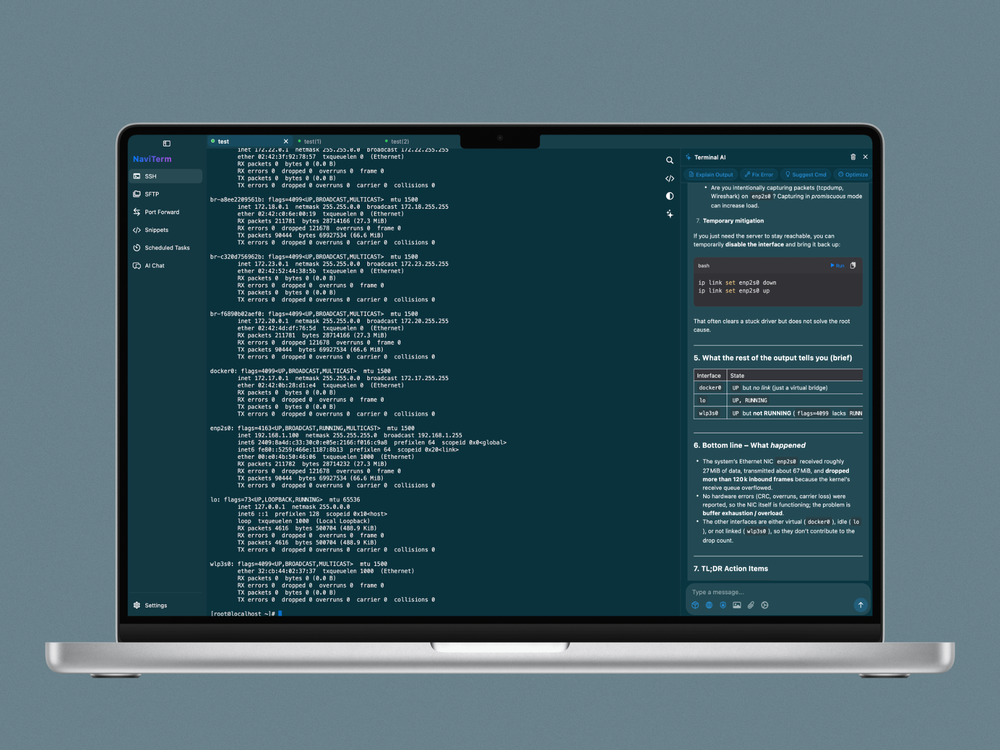
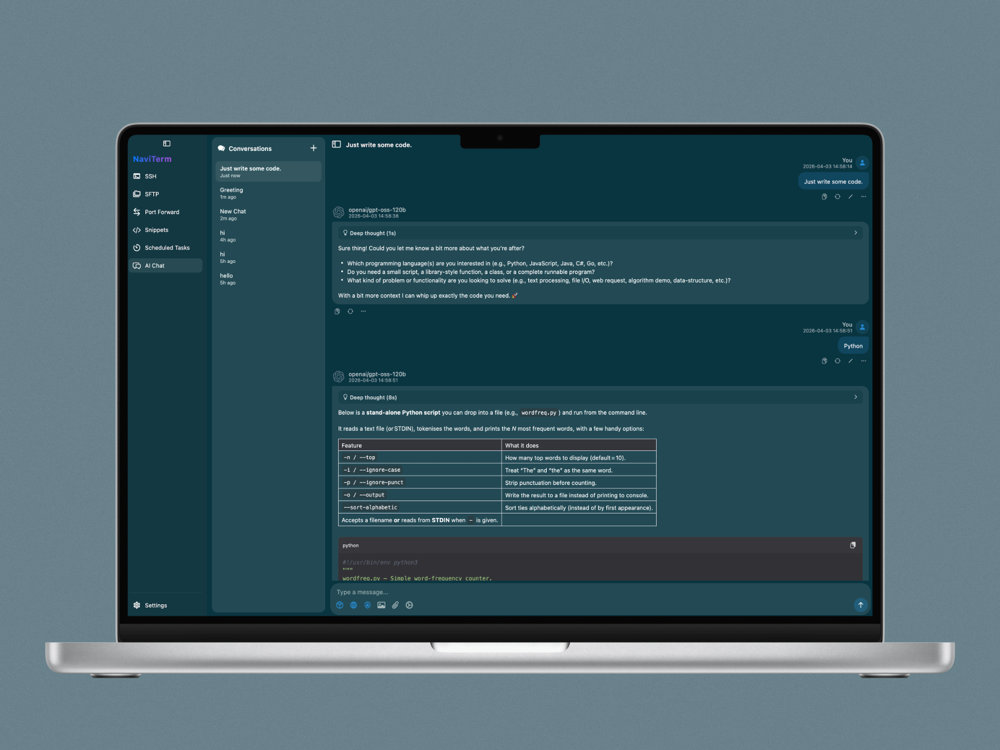
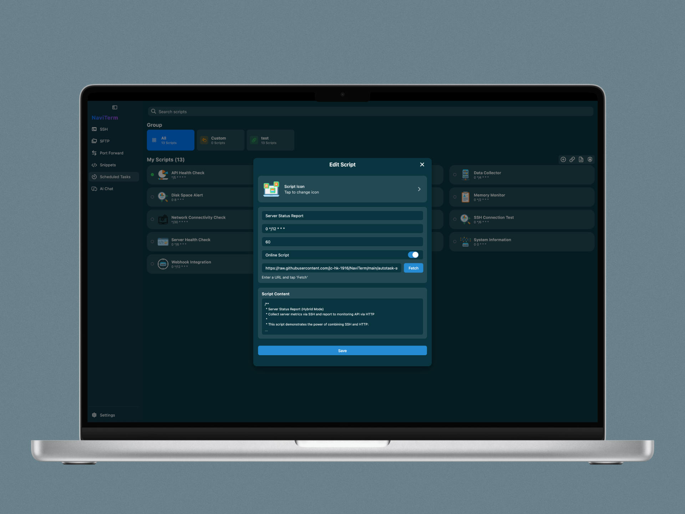
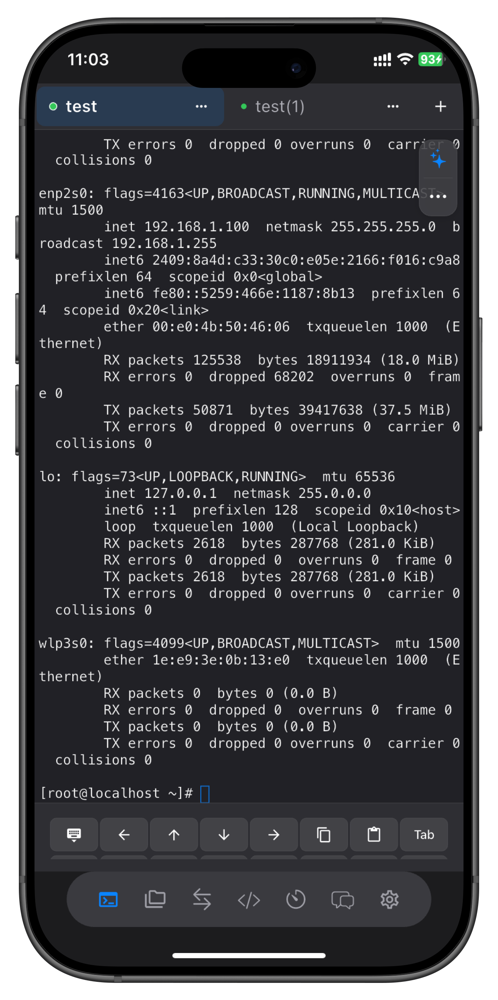
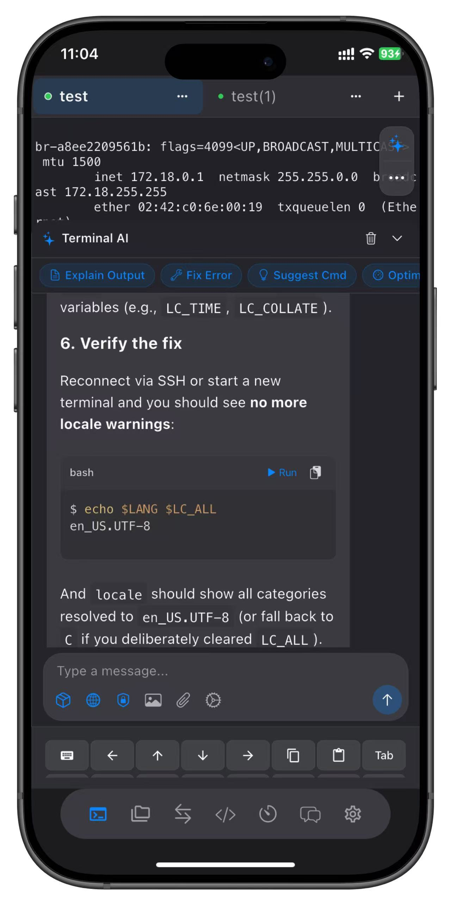
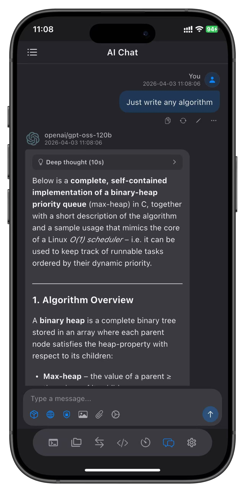
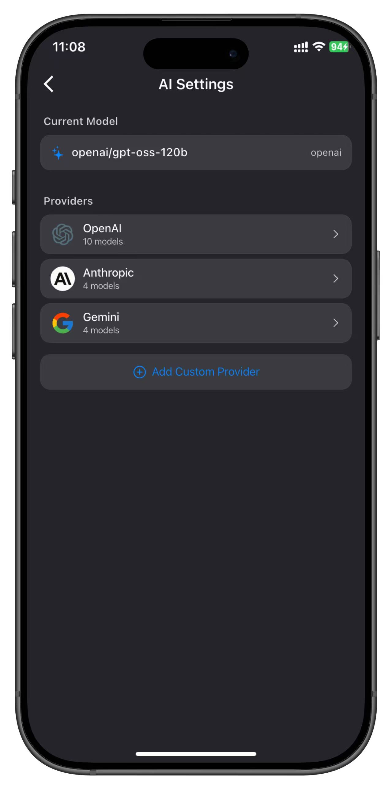
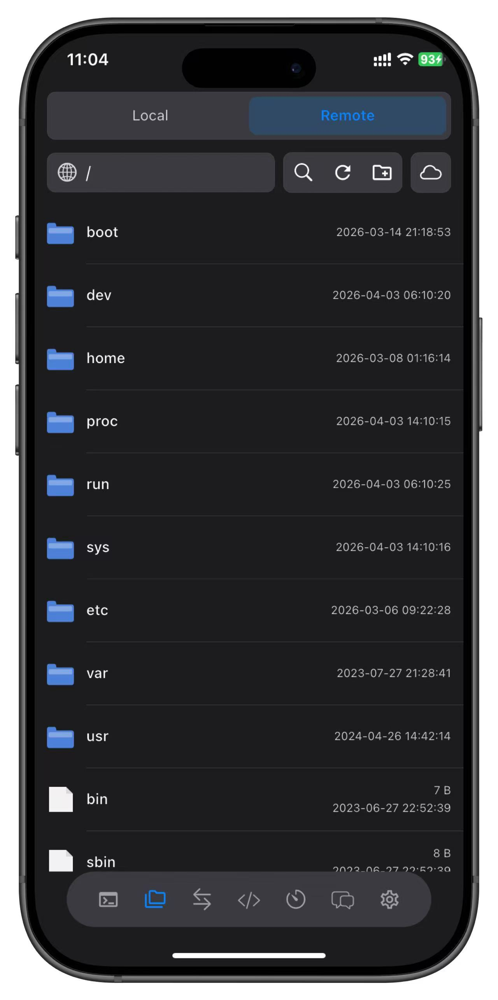
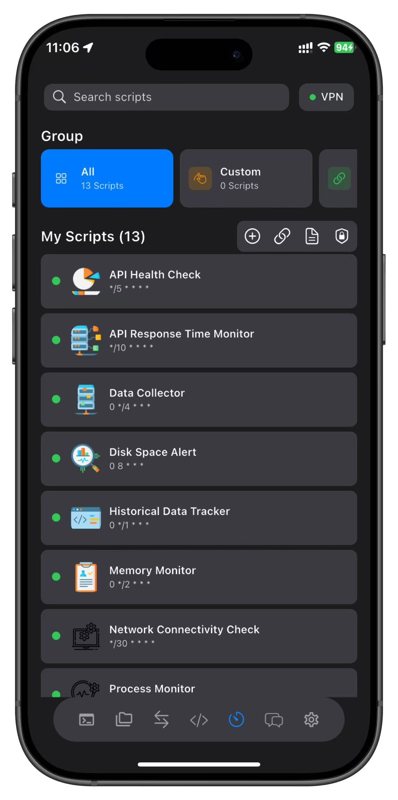

# NaviTerm

言語 / Language: 日本語 | [English](README.md) | [中文](README.zh.md) | [Español](README.es.md) | [Français](README.fr.md) | [Deutsch](README.de.md) | [Русский](README.ru.md)

AIアシスタントを統合した、プロフェッショナル向けのSSH運用管理ツール。SSHクライアント、SFTPファイル管理、ポートフォワーディング、自動化タスク、そしてAIアシスタント機能を一つに。macOS、iPhone、iPadのために特別に設計されました。このアプリ一つで、リモート管理のあらゆるニーズに対応。iCloud同期とバックグラウンドでの接続維持もサポートしています。

---

## 主な特徴

### AIアシスタント
- ターミナルにAIパネルを内蔵。OpenAI、Claude、Geminiなど多様なAIサービスに対応
- コマンド出力の説明、エラー修正、スクリプト最適化、セキュリティチェックをワンクリックで
- マルチセッションでの対話管理、カスタムシステムプロンプトのテンプレート機能
- スマートなコマンド提案で、運用効率を格段に向上

### 自動化タスクエンジン
- 手間のかかる運用タスクを定期実行し、作業を自動化
- プログラミング知識がなくても使える、ビジュアルスクリプトエディタ
- サーバー監視、ログ分析、一括デプロイなど、豊富なテンプレートを内蔵
- 複数サーバーへの一括操作も、ワンクリックで完了

### iOSバックグラウンド実行 + iCloud同期
- SSH/SFTP/ポートフォワーディングのセッションをバックグラウンドで維持。アプリを切り替えても中断されません
- ホスト設定やコマンドスニペットが、iPhone、iPad、Mac間でリアルタイムに同期
- クラウドでの変更は自動的にプッシュされ、どのデバイスからでもすぐに利用可能

---

## プロフェッショナル機能

### SSHターミナル
- RSA、ED25519、P256キー認証に対応
- 複数タブでの管理、完全なターミナルエミュレーション
- ターミナル内での検索とハイライト、AIによるスマートアシスト

### SFTPファイル管理
- デュアルパネル表示で、ドラッグ＆ドロップによるアップロード・ダウンロード
- ファイル操作、権限変更、転送状況のプログレス表示
- 多様なファイル形式のプレビューに対応

### ポートフォワーディング
- ローカル/リモートポートフォワーディング、SOCKS5プロキシ
- SSHトンネルによる暗号化通信で、内部ネットワークサービスへ安全にアクセス

### コマンドスニペット
- よく使うコマンドを保存し、ワンタップで素早く実行
- 変数置換をサポートし、自分だけのコマンドライブラリを構築

---

## セキュリティと信頼性

- 安全・安心：エンドツーエンドのSSH暗号化。秘密鍵はローカルのみに保存され、データ収集は一切行いません
- グローバル対応：25以上の言語をサポート
- ネイティブ体験：Appleのデザイン言語に完全に準拠した、使いやすいインターフェース

---

## 特別な感謝

このアプリは以下の素晴らしいオープンソースプロジェクトで構築されています：

- [dartssh2](https://github.com/TerminalStudio/dartssh2) - Dart用SSHクライアントライブラリ
- [xterm.dart](https://github.com/TerminalStudio/xterm.dart) - Flutter用ターミナルエミュレーター

---

## サブスクリプションモデル

- **無料版**：最大5ホストで完全な機能体験
- **Pro版**：柔軟な月額または年額プランで無制限のホスト
- **Proサブスクライバーはオフライン使用サポートを享受**

---

## ダウンロード

---

## コミュニティに参加

- 📢 [Telegramチャンネル](https://t.me/khgk180_na) - 最新のアップデート、機能リリース、重要なお知らせを入手
- 💬 [Telegram討論グループ](https://t.me/kkkhjo_ut357) - 他のユーザーと交流し、ヒントを共有し、経験を交換

---

## プロモコード引き換えガイド

無料サブスクリプションプロモコード（1ヶ月または1年）を時々提供しています。プロモコードを受け取った場合：

1. iPhoneまたはMacでApp Storeを開く；
2. プロフィールアイコンをタップ > ギフトカードまたはコードを使う；
3. プロモコードを貼り付けて確認；
4. NaviTermアプリを開くと、サブスクリプションが自動的にアクティブ化されます。

📎 [利用可能な月額プロモコードを表示するにはここをクリック](promo-codes/monthly.txt)
📎 [利用可能な年額プロモコードを表示するにはここをクリック](promo-codes/yearly.txt)

> 数量限定、先着順。登録や個人情報は不要です。

---

## 法的情報

- [利用規約](https://www.apple.com/legal/internet-services/itunes/dev/stdeula/)
- [プライバシーポリシー](https://www.trivix.cn/NaviTerm_Privacy_Policy.html)
- [変更履歴](CHANGELOG.md)

---

<table style="width: 100%;">
<!-- 第一行 -->
<tr>
<td width="33.3%"></td>
<td width="33.3%"></td>
<td width="33.3%"></td>
</tr>
<!-- 第二行 -->
<tr>
<td width="33.3%"></td>
<td width="33.3%"></td>
<td width="33.3%"></td>
</tr>
</table>