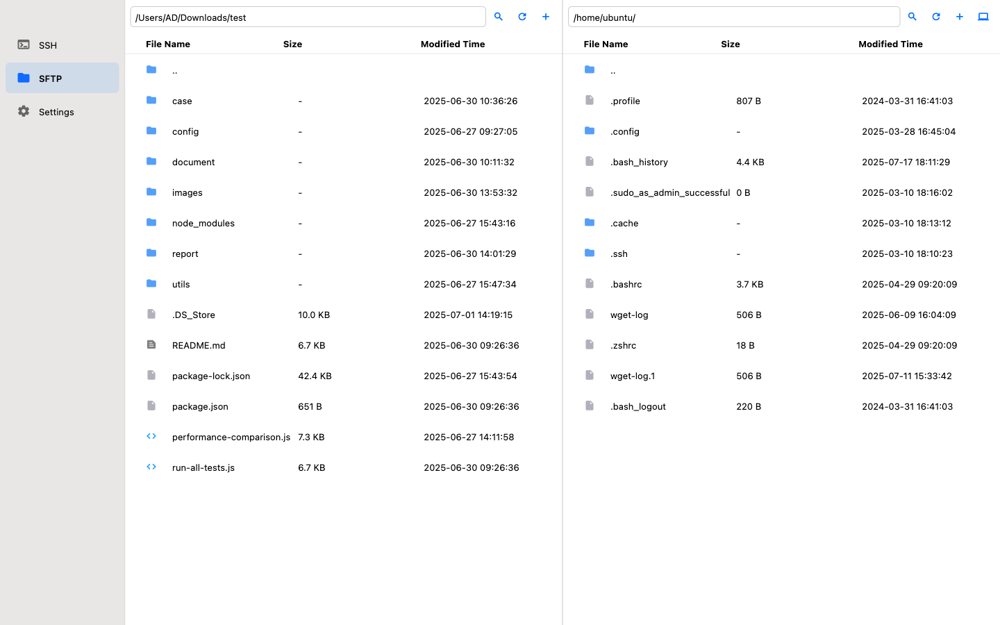

# NaviTerm

Language / 语言: [English] | [中文](README.zh.md)

A cross-platform SSH and SFTP client designed for secure remote access, file transfer, and port forwarding. Available on macOS and iOS (iPhone / iPad), with support for 20 languages, it's built for efficient and streamlined remote management.

---

### ✨ Key Features

- **SSH Terminal Access**  
  Securely connect to remote servers via SSH using either password or private key authentication. Supports interactive shell sessions, ideal for system maintenance and command execution.

- **SFTP File Management**  
  Browse the remote server's file system with support for upload, download, rename, delete, and file preview across various formats.

- **Local and Remote Port Forwarding**  
  Configure SSH tunnels for forwarding local ports to remote hosts (Local Forwarding) or remote ports to local services (Remote Forwarding). Useful for development, database access, and accessing restricted network services.

- **Key Management**  
  Import OpenSSH-format private keys, supporting both encrypted and unencrypted types such as RSA and ED25519.

- **Multi-Device Support**  
  Seamlessly sync and operate across Mac, iPhone, and iPad with a UI optimized for each platform, enabling remote access anytime, anywhere.

- **Connection Session Storage**  
  Save frequently used server configurations for quick access. Supports grouping by tags and adding custom notes.

---

### 🔒 Privacy & Security

- All connections are established over the SSH encryption protocol. No server or account information is collected.
- Private keys are stored locally on your device and are never uploaded to the cloud.

---

### 🛠️ Example Use Cases

- Log into VPS or cloud servers to execute system commands
- Configure and manage Linux/Unix servers
- Upload, download, or edit remote files
- Set up local proxies, debug databases, or access intranet services (via port forwarding)

---

This app is designed to be a simple yet powerful remote management tool to help users efficiently complete SSH and SFTP tasks across platforms.

