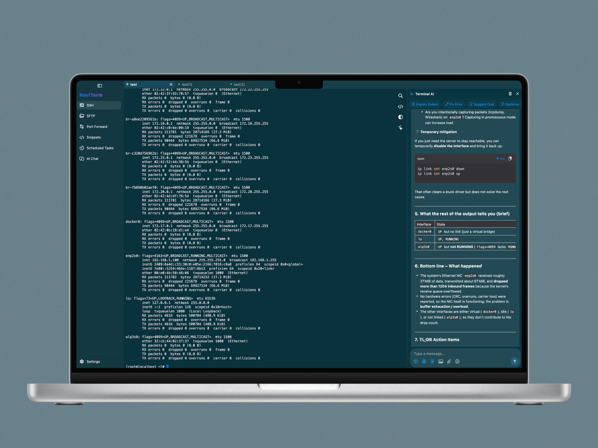
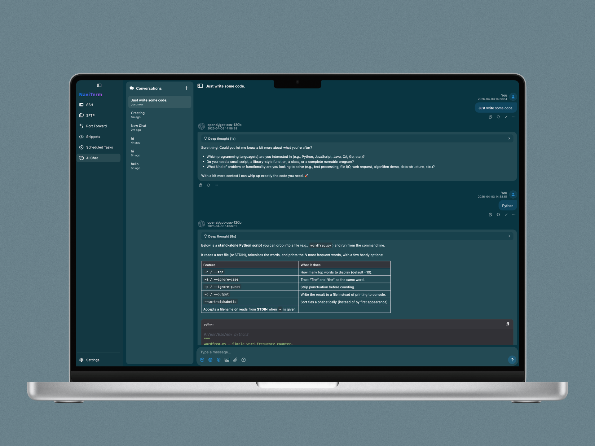
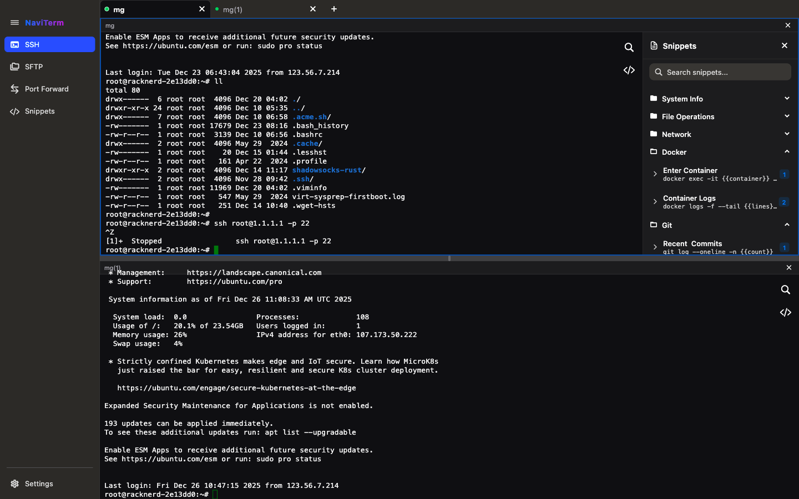
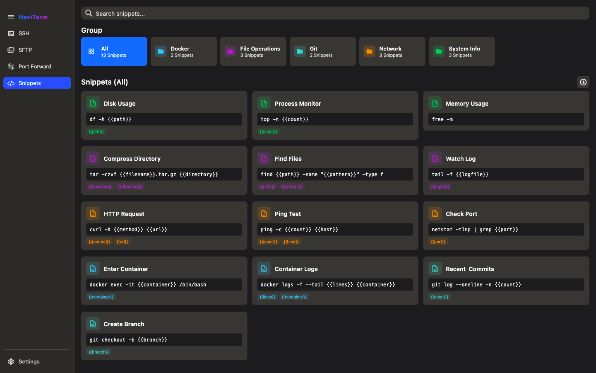
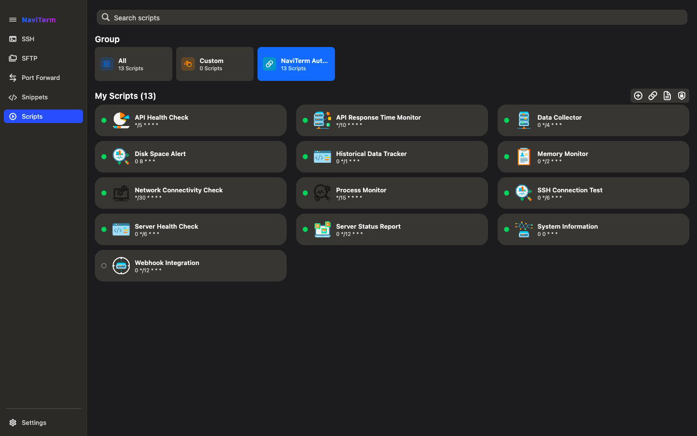
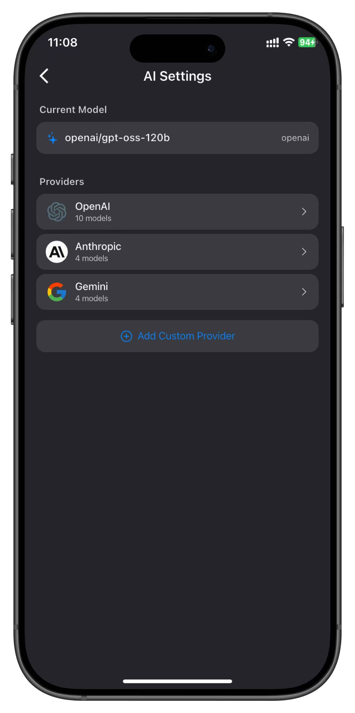
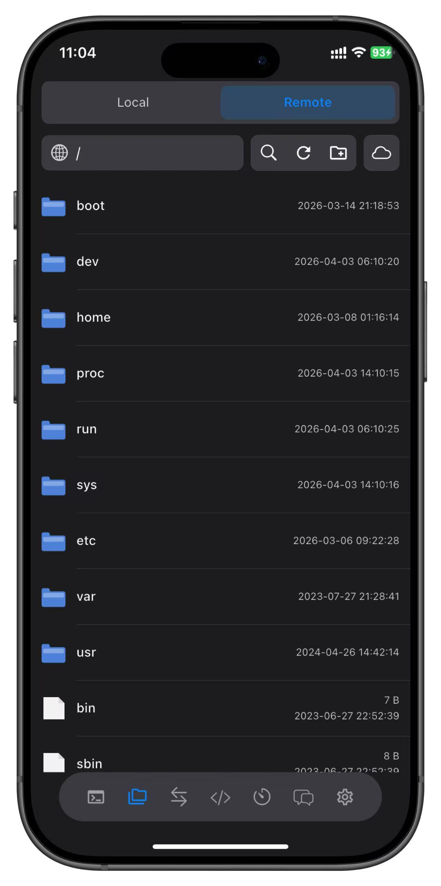
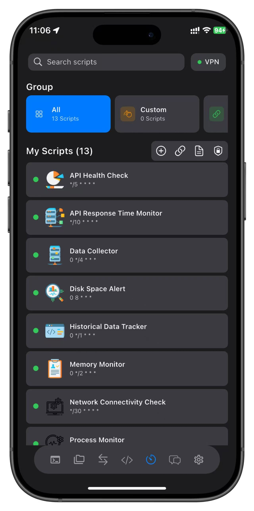
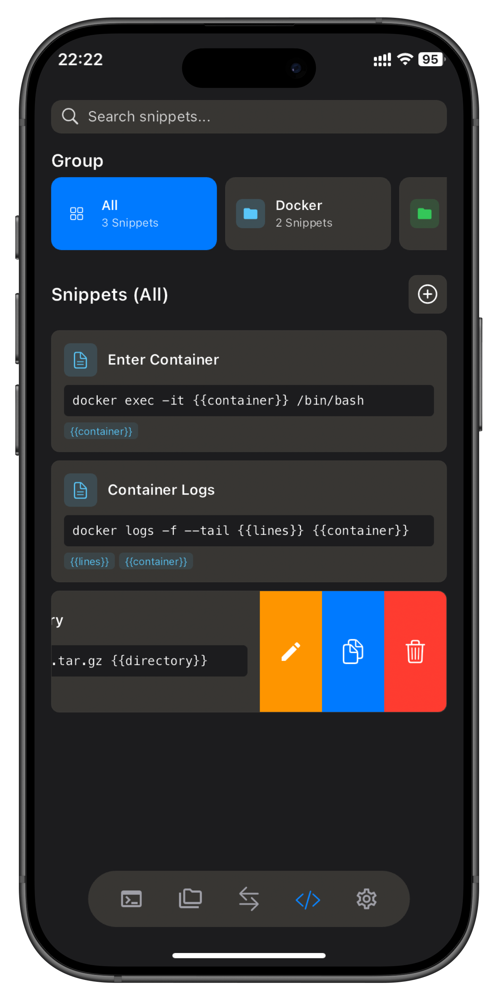
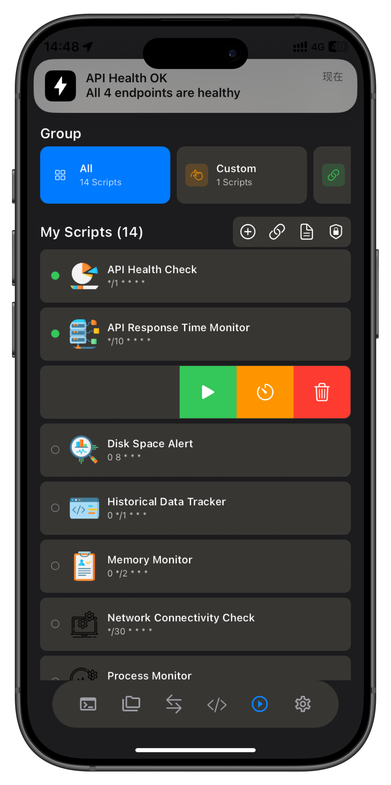

# NaviTerm

Язык / Language: Русский | [English](README.md) | [中文](README.zh.md) | [Español](README.es.md) | [Français](README.fr.md) | [Deutsch](README.de.md) | [日本語](README.ja.md)

Автоматизируйте работу с серверами с помощью профессионального SSH-инструмента. Интегрирует SSH-терминал, управление файлами SFTP, перенаправление портов, автоматизированные задачи и фрагменты команд – создан с нуля для macOS, iPhone и iPad. Одно приложение для решения всех задач удаленного управления, с синхронизацией iCloud и фоновой активностью.

---

## ✨ Новые Функции

### Движок Автоматизации Задач
- Планируйте автоматическое выполнение повторяющихся операций
- Визуальный редактор скриптов без необходимости программирования
- Богатые встроенные шаблоны: мониторинг серверов, анализ логов, массовое развертывание
- Пакетные операции на нескольких серверах одним касанием
- Полные журналы задач с четкими результатами выполнения

### Фоновая Активность
- Сеансы SSH/SFTP/Перенаправления Портов продолжают работать в фоновом режиме
- Соединения остаются активными, даже когда вы переключаете приложения или блокируете экран

### Синхронизация iCloud между Устройствами
- Хосты, перенаправления портов и фрагменты команд синхронизируются в реальном времени между iPhone, iPad и Mac
- Добавьте конфигурацию на любом устройстве, и она мгновенно станет доступна на всех остальных
- Тихие push-уведомления автоматически синхронизируют изменения из облака

---

## 🔧 Основные Функции

### SSH-Терминал
- Аутентификация по паролю и закрытому ключу (RSA, ED25519, P256)
- Управляйте несколькими серверами одновременно с интерфейсом вкладок
- Полная эмуляция терминала с поддержкой цветов и специальных символов
- Поиск в терминале с подсветкой

### Фрагменты Команд
- Сохраняйте часто используемые команды для выполнения одним касанием
- Создайте свою личную библиотеку команд и забудьте о повторном вводе
- Подстановка переменных для гибкой адаптации к различным сценариям

### Управление Файлами SFTP
- Двухпанельный файловый браузер с загрузкой/выгрузкой перетаскиванием
- Переименование, удаление файлов и изменение прав доступа
- Прогресс передачи в реальном времени с поддержкой отмены
- Предварительный просмотр нескольких типов файлов

### Перенаправление Портов
- Локальное/удаленное перенаправление портов
- Динамический прокси SOCKS5
- Шифрование SSH-туннеля
- Безопасный доступ к внутренним сетевым службам

### Управление Ключами
- Совместимость с OpenSSH: поддержка Ed25519, RSA, P256/EC
- Безопасное локальное хранилище, никогда не загружается
- Быстрая аутентификация одним касанием

---

## 🎯 Технические Особенности

- **Безопасно и Надежно**: Сквозное SSH-шифрование, закрытые ключи хранятся только локально, никакого сбора данных
- **Глобальный**: Поддержка более 25 языков
- **Нативный Опыт**: Идеально адаптирован к языку дизайна Apple, адаптивная верстка, жестовое управление

---

## 🙏 Особая Благодарность

Это приложение создано с использованием следующих замечательных проектов с открытым исходным кодом:

- [dartssh2](https://github.com/TerminalStudio/dartssh2) - SSH-клиентская библиотека для Dart
- [xterm.dart](https://github.com/TerminalStudio/xterm.dart) - Эмулятор терминала для Flutter

---

## 💎 Модель Подписки

- **Бесплатная Версия**: Полный функционал с поддержкой до 5 хостов
- **Pro Версия**: Неограниченное количество хостов с гибкими месячными или годовыми планами
- **Подписчики Pro получают поддержку автономного использования**

---

## 🚀 Скачать

---

## 💬 Присоединяйтесь к Нашему Сообществу

- 📢 [Telegram-канал](https://t.me/khgk180_na) - Получайте последние обновления, релизы функций и важные объявления
- 💬 [Telegram-группа для обсуждений](https://t.me/kkkhjo_ut357) - Общайтесь с другими пользователями, делитесь советами и обменивайтесь опытом

---

## 🎁 Руководство по Активации Промокода

Мы периодически предлагаем бесплатные промокоды подписки (1 месяц или 1 год). Если вы получили промокод:

1. Откройте App Store на вашем iPhone или Mac;
2. Нажмите на значок профиля > Погасить подарочную карту или код;
3. Вставьте промокод и подтвердите;
4. Откройте приложение NaviTerm, и подписка будет активирована автоматически.

📎 [Нажмите здесь, чтобы просмотреть доступные месячные промокоды](promo-codes/monthly.txt)
📎 [Нажмите здесь, чтобы просмотреть доступные годовые промокоды](promo-codes/yearly.txt)

> Ограниченное количество, кто первый пришел, тот первый получил. Регистрация или личная информация не требуется.

---

## 📜 Юридическая Информация

- [Условия Использования](https://www.apple.com/legal/internet-services/itunes/dev/stdeula/)
- [Политика Конфиденциальности](https://www.trivix.cn/NaviTerm_Privacy_Policy.html)
- [История Изменений](CHANGELOG.md)

---

