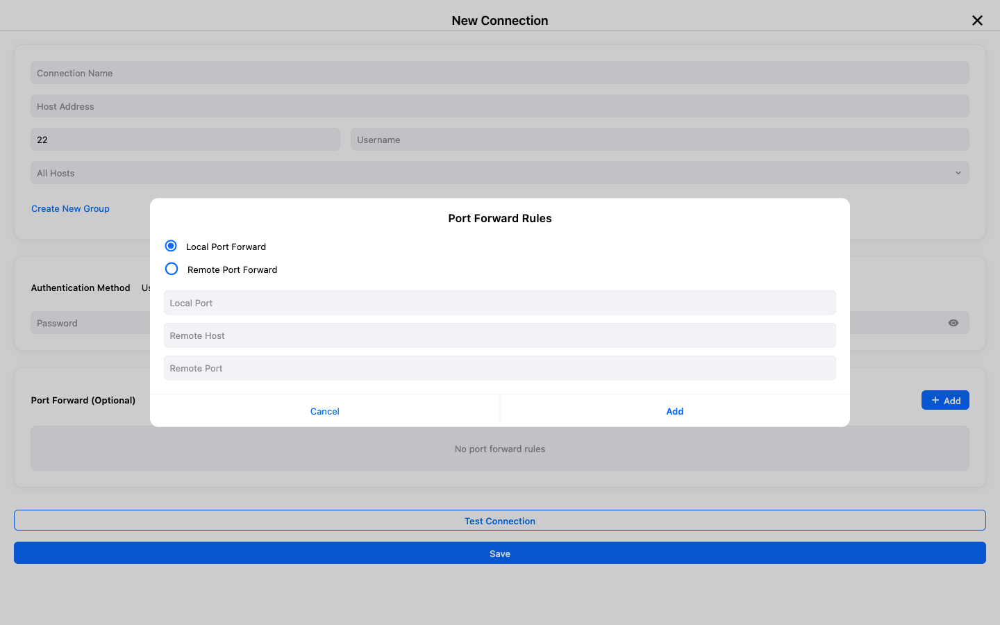

# NaviTerm

专业SSH终端、SFTP文件管理器与端口转发工具，专为macOS、iPhone和iPad打造。一款应用，三大核心功能，满足系统管理员、开发者、运维工程师和技术爱好者的远程服务器管理需求。支持iCloud同步，iOS后台保活，让您随时随地安全连接服务器。

---

## ✨ 全新特性

### iOS后台保活
- SSH/SFTP/端口转发会话在后台持续运行
- 切换应用或锁屏后连接不中断，长时间任务稳定执行
- 智能心跳保活机制，确保会话长期在线

### iCloud跨设备同步
- 主机配置通过iCloud在iPhone、iPad、Mac间实时同步
- 在任意设备添加服务器，其他设备即刻可用
- 支持静默推送，云端变更自动同步到本地
- 冲突自动解决，多设备编辑无忧

---

## 🔧 核心功能

### SSH终端访问
- 支持密码和私钥（RSA、ED25519、P256）多种认证方式
- 高性能异步引擎，响应迅速流畅
- 多标签页管理，同时连接多个服务器
- 完整的终端仿真，支持颜色和特殊字符
- 终端内搜索高亮，快速定位关键信息

### SFTP文件管理
- 直观的双面板文件浏览器
- 支持文件上传、下载、重命名、删除、修改权限
- 传输进度实时显示，支持取消操作
- 多种文件类型预览功能
- 拖拽操作，简化文件传输流程

### 端口转发
- 本地端口转发和远程端口转发
- SSH隧道代理设置
- 内网环境安全访问
- 服务测试和调试支持

### 密钥管理
- OpenSSH兼容私钥导入
- 支持Ed25519、RSA、P256/EC多种密钥格式
- 本地安全存储，绝不上传
- 支持加密和未加密密钥
- 一键快速认证连接

---

## 🔒 安全与隐私

- **端到端加密**：所有连接通过SSH协议加密保护
- **本地存储**：私钥和敏感信息仅存储在您的设备上
- **零数据收集**：我们不收集或共享您的任何连接信息
- **开源透明**：核心功能基于开源技术构建

---

## 🌍 全球化支持

支持25+种语言，包括：英文、日文、韩文、德文、法文、西班牙文、葡萄牙文、意大利文、俄文、阿拉伯文、印地语、波斯语、泰语、越南语、印尼语、简体中文、繁体中文等

---

## 💎 订阅模式

- **免费版本**：完整功能体验，支持最多5个主机连接
- **专业订阅**：无限主机连接，月度/年度灵活选择
- **离线支持**：订阅用户享受离线使用保障

---

## 🎨 设计亮点

- **原生体验**：完美适配Apple设计语言
- **响应式布局**：针对不同屏幕尺寸优化
- **手势操作**：iPhone/iPad专属触控体验

---

## 🚀 下载

---

## 🎁 促销码兑换说明

我们不定期提供免费订阅兑换码（1 个月或 1 年），如果你收到了兑换码：

1. 打开 iPhone 或 Mac 上的 App Store；
2. 点击头像 > **兑换礼品卡或代码**；
3. 粘贴兑换码并确认；
4. 打开 **NaviTerm** 应用，订阅将自动生效。

📎 [点击查看可用的月度兑换码](promo-codes/monthly.txt)
📎 [点击查看可用的年度兑换码](promo-codes/yearly.txt)

> 数量有限，先到先得，无需注册账号，无需上传信息。

---

## 📜 法律信息

- [使用条款](https://www.apple.com/legal/internet-services/itunes/dev/stdeula/)
- [隐私政策](https://www.trivix.cn/NaviTerm_Privacy_Policy.html)
- [更新日志](CHANGELOG.zh.md)

---

